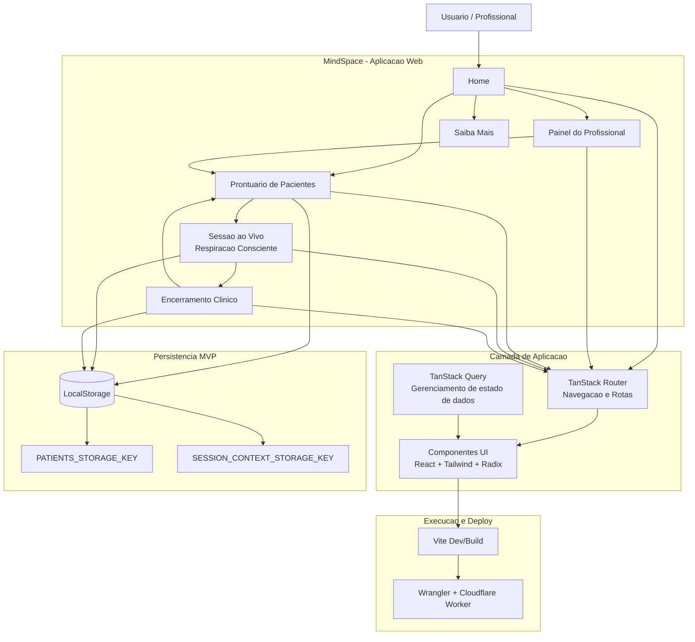

# MindSpace 🤖

MindSpace e uma aplicacao web para apoio a saude mental com ambientes terapeuticos imersivos.
A proposta do projeto e oferecer uma jornada digital que conecta acolhimento, acompanhamento profissional e registro clinico em um fluxo unico.

## Proposta

O projeto foi desenhado para apoiar profissionais e pacientes em sessoes guiadas, com foco em:

- acolhimento e reducao de sobrecarga emocional
- acompanhamento estruturado da jornada terapeutica
- registro clinico organizado para evolucao de cuidado
- experiencia imersiva com respiracao consciente e ambiente visual calmante

Importante: a plataforma nao substitui atendimento psicologico profissional. Ela funciona como tecnologia de apoio ao cuidado.

## Experiencia Criada

A experiencia do produto segue um fluxo continuo:

1. Entrada e contexto
- Pagina inicial com apresentacao da proposta e CTA para iniciar fluxo clinico.

2. Prontuario de pacientes
- Cadastro e atualizacao de pacientes.
- Registro de anamnese.
- Visualizacao de sessoes, encerramentos e timeline clinica.

3. Sessao ao vivo
- Ambiente terapeutico com respiracao consciente guiada.
- Controles de sessao (iniciar, pausar, reiniciar) e cronometria.
- Confirmacao de saida com modal padrao.

4. Encerramento
- Registro de ansiedade antes/depois, avaliacao e anotacoes finais.
- Persistencia do encerramento no prontuario para historico clinico.

5. Navegacao de fluxo
- Breadcrumb padronizado entre Painel, Prontuario, Sessao ao vivo e Encerramento para orientar o usuario durante toda a jornada.

## Tecnologias Utilizadas

- React 19
- TypeScript
- TanStack Start
- TanStack Router
- TanStack Query
- Vite
- Tailwind CSS v4
- Lucide Icons
- Radix UI (base de componentes)
- Cloudflare Wrangler (configuracao para deploy em Worker)
- ESLint e Prettier

## Equipe

- Tech Lead: Mateus Joias
- Desenvolvedores:  Bernado Brito e Jones Mendes
- Designer de Ambiente / Experiencia: Bernado Brito, Jones Mendes, Marcio Morais e Mateus Joias
- QA / Produto: Marcio Morais

## Estrutura Funcional

Principais areas do sistema:

- Home institucional
- Painel do profissional
- Prontuario de pacientes
- Sessao imersiva
- Encerramento clinico
- Pagina institucional Saiba Mais

Persistencia atual:

- LocalStorage para contexto de sessao e dados clinicos no MVP

## Instalacao

Pre-requisitos:

- Node.js 20+ (recomendado)
- npm 10+ (ou versao compativel)

Passos:

1. Instalar dependencias
- npm install

2. Rodar ambiente de desenvolvimento
- npm run dev

## Execucao

Comandos principais:

- Desenvolvimento: npm run dev
- Build de producao: npm run build
- Build em modo development: npm run build:dev
- Preview local da build: npm run preview
- Lint: npm run lint
- Formatacao: npm run format

## Acesso

### Acesso local

Ao executar npm run dev, o Vite abre a aplicacao automaticamente no navegador.
Em geral, o acesso local fica em:

- http://localhost:5173

### Acesso em producao

O projeto possui configuracao Wrangler para Cloudflare Worker.
A publicacao depende do ambiente e conta configurados.
Depois do deploy, o acesso e feito pela URL fornecida pela Cloudflare para o servico.

## Observacoes de Ambiente

- Arquivos gerados automaticamente (como cache/framework) nao devem ser versionados.
- O arquivo de rotas gerado e mantido automaticamente pelo TanStack Router.
- O projeto utiliza padronizacao de codigo com Prettier e regras de qualidade com ESLint.

## Diagrama 

## Roadmap Sugerido

- Integracao com backend persistente (banco de dados)
- Controle de autenticacao e perfis (profissional/paciente)
- Telemetria e indicadores clinicos agregados
- Auditoria de alteracoes no prontuario
- Publicacao com CI/CD e ambiente de homologacao
